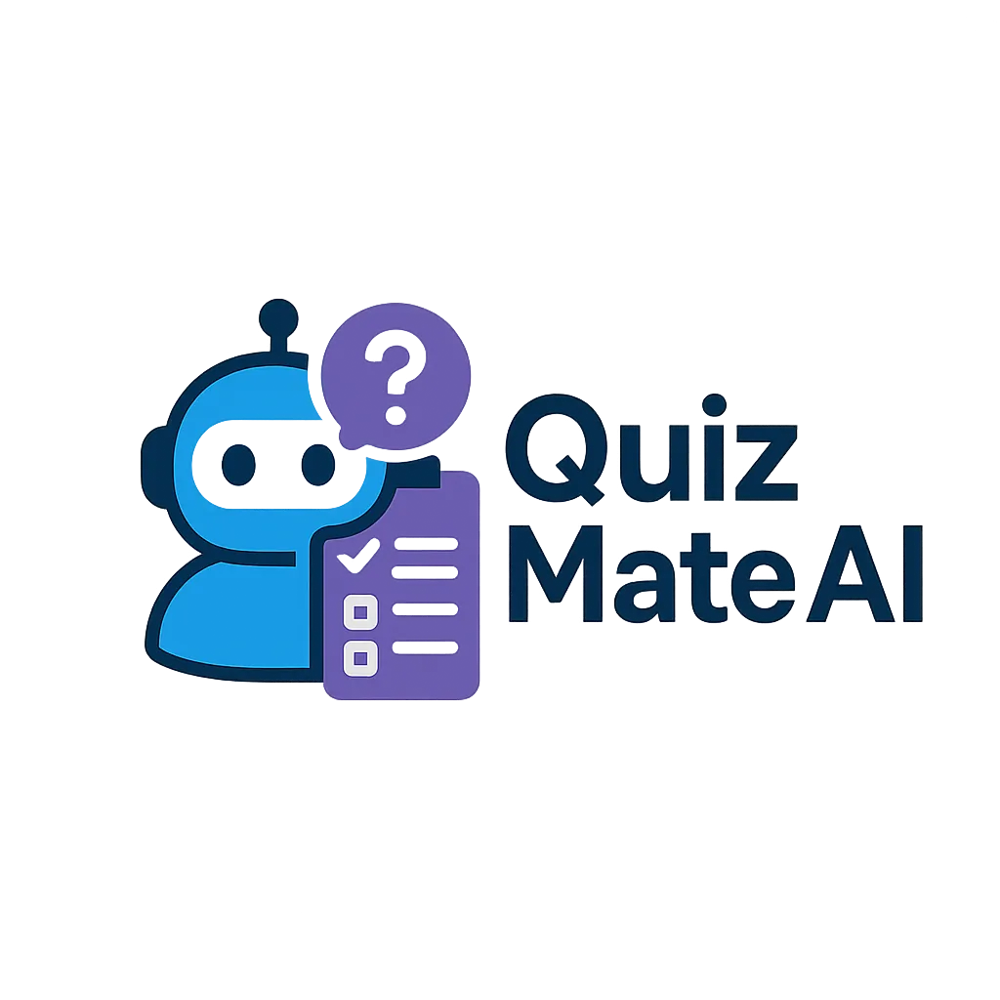

<div align="center">



# QuizMate AI

**Chinh phục kiến thức cùng AI** — An AI-powered platform that turns your study materials into personalized quizzes, flashcards, and learning roadmaps.

[](https://react.dev)
[](https://vitejs.dev)
[](https://tanstack.com/query)
[](https://tailwindcss.com)
[](https://www.i18next.com)
[](https://vitest.dev)

</div>

---

## The problem

In the era of self-directed learning and collaborative online education, individuals and learning groups increasingly seek tools that help them design structured assessments based on their own study materials. Yet, **manually creating quizzes from varied learning resources** — PDFs, images, videos, or YouTube links — is **time-consuming and lacks personalization**.

Generic quiz banks rarely match the depth, scope, or pacing a learner actually needs. Group study sessions struggle to coordinate progress, share materials, and validate understanding without a shared toolset. Educators and team leads spend hours preparing content that quickly goes stale.

## Our solution

QuizMate AI is designed to solve this challenge by providing an **AI-powered platform** that can:

- **Analyze uploaded materials** — PDFs, slides, images, audio, video, and URLs (including YouTube) — and extract the underlying knowledge.
- **Generate quizzes and structured test sequences** that match each learner's goals, knowledge level, and pacing preferences.
- **Support deep customization** of quiz design, difficulty, question type mix, and evaluation strategy.
- **Power both individual workspaces and group study rooms**, so the same platform serves a solo learner and a class of contributors.

The system provides AI-driven assistance, interactive testing modes, progress tracking, and collaborative tools for peer-based learning.

<div align="center">

</div>

---

## Key features

### For individual learners

- **Workspace per topic** — keep materials, quizzes, flashcards, and mock tests scoped to a learning goal.
- **Multi-format upload** — PDF, slides, images, audio, video, and URLs as source material.
- **AI-generated quizzes** — multiple-choice, multi-select, true/false, fill-in-the-blank, short answer.
- **Adaptive learning roadmap** — multi-phase plan with knowledge nodes, pre-learning checks, and per-phase quizzes.
- **Flashcards with spaced review** — auto-generated from materials or manually authored.
- **Mock tests** — timed, full-length practice sessions with results breakdown.
- **Practice and exam modes** — switch between guided study and timed assessment.
- **Math rendering** — KaTeX support for STEM content.
- **Progress tracking** — per-material, per-phase, and per-quiz status with realtime websocket updates.

### For study groups

- **Shared group workspace** — invite members, share materials, and run group-wide content.
- **Role-based collaboration** — Leader, Content Manager, Contributor, Analyst, Member.
- **Group challenges** — live competitions in three modes:
  - *Free-for-all* — solo race on a shared quiz, ranked by score and time.
  - *Team battle* — 2-team formats with auto-balance or fixed team size.
  - *Solo bracket* — 4 / 8 / 16 / 32 single-elimination tournaments.
- **Quiz review workflow** — invite reviewers, accept/reject, then publish to members.
- **Group ranking** — overall and per-source leaderboards with podium animations.
- **Member dashboard** — per-member analytics for leaders and analysts.
- **Audience targeting** — assign a quiz to all, selected members, or contributors only.

### For administrators

- **Admin backoffice** — manage users, plans, credit packages, and group accounts.
- **Super admin tooling** — RBAC, AI cost tracking, AI provider catalog, model audit logs, feedback triage, topic management.
- **Payment management** — review transactions across gateways with full payload trails.

### Cross-cutting

- **Bilingual UI** — Vietnamese and English with route-scoped namespaces.
- **Realtime updates** — STOMP / WebSocket for quiz generation, challenge state, and group activity.
- **Inactivity safeguards** — runtime recovery for lost connections, idle warnings before logout.
- **Feedback channel** — in-app feedback submission with structured survey forms.

---

## How AI assists and refines learning

QuizMate AI uses AI as the workflow's engine, not just a chat companion.

| Step | What AI does |
|---|---|
| **Knowledge extraction** | Parses PDFs, slide decks, images, audio transcripts, and video / URL content into structured knowledge nodes. |
| **Roadmap suggestion** | Recommends a roadmap configuration (knowledge load, adaptation mode, pacing, total days, minutes per day) tailored to the user's profile. |
| **Phase generation** | Breaks a roadmap into ordered phases with checkpoint quizzes and optional pre-learning to prime new material. |
| **Quiz generation** | Produces quizzes by topic, difficulty, question count, and question type mix; supports knowledge-scoped quizzes inside a roadmap phase. |
| **Pre-learning decisions** | Decides whether a phase needs a warm-up before the main content based on the learner's prior progress. |
| **Mock test generation** | Builds full-length mock tests from a workspace or topic, with realtime progress updates over WebSocket. |
| **Flashcard generation** | Extracts key terms and definitions, ready for spaced-repetition review. |
| **Adaptive refinement** | Re-evaluates roadmap progress, surfaces weak areas, and proposes follow-up quizzes or knowledge reviews. |
| **AI cost transparency** | Backoffice shows token usage and cost per provider; super admins can swap models per action policy. |

---

## Plans, credits, and access policies

### Subscription plans

- **Free tier** — limited monthly AI quota, single workspace, basic flashcards.
- **Paid plans** — higher AI quotas, multiple workspaces, advanced roadmap features, group seat allocations.
- **Plan gating** — premium features (analytics, advanced roadmap, mock test, challenges) are progressively unlocked.

### Credit system

- AI actions are metered in **credits**.
- Users top up credits via **VNPAY**, **MoMo**, or **Stripe**.
- Group leaders can manage a **group wallet** that funds shared AI work.
- Each credit transaction is logged with source type (AI usage, top-up, refund) and a human-readable note.

### Roles and permissions

| Role | Scope | Typical capabilities |
|---|---|---|
| Member | Group | View shared content, take quizzes |
| Contributor | Group | Upload materials, create quizzes / flashcards / roadmaps |
| Analyst | Group | View member dashboard and stats |
| Content Manager | Group | Publish quizzes, assign audience, delete content |
| Leader | Group | All of the above + manage members, settings, group wallet |
| Admin | System | Manage users, plans, credit packages, payments |
| Super Admin | System | RBAC, AI cost & audit, provider catalog, feedback triage |

Frontend permission gates mirror backend permission codes — they are UX hints, **not security**. All authorization is enforced server-side.

### Data and privacy

- Uploaded materials stay scoped to the workspace they were added to.
- Group materials are visible only to that group's members under their assigned role.
- Authentication uses Google OAuth and a session token stored in browser storage with auto-refresh.

---

## Technologies

| Area | Library |
|---|---|
| UI runtime | React 19 |
| Build tool | Vite 7 |
| Routing | React Router v7 |
| Server state | TanStack Query 5 |
| UI primitives | shadcn-style + Radix UI |
| Styling | Tailwind CSS 3 |
| Internationalization | i18next + react-i18next |
| HTTP client | Axios |
| WebSocket | STOMP over SockJS |
| Charts | Recharts |
| Math rendering | KaTeX |
| Authentication | Google OAuth |
| Testing | Vitest 4 + Testing Library |
| Linting | ESLint 9 (flat config) |

---

## Project structure

```
src/
├── api/             REST + WebSocket clients per backend domain
├── assets/          Static images
├── components/      Shared UI
│   ├── ui/          Base primitives
│   └── features/    Feature blocks (admin, users, workspace, group-leader ...)
├── context/         Global providers (toast, navigation, profile)
├── hooks/           Reusable business logic
├── i18n/            Translation files (en, vi)
├── lib/             Framework wiring (queryClient, routePaths, errorCodes)
├── pages/           Route-level pages (admin, authentication, users, ...)
├── test/            Vitest + Testing Library coverage
└── utils/           Helpers (apiResponse, userCache, validation ...)
```

Per-screen specifications live in [`docs/screen-specs/`](./docs/screen-specs/).

---

## Getting started

Requires **Node.js 20+** and **npm**.

```bash
# 1. Install dependencies
npm install

# 2. Configure environment
#    Edit .env or .env.production with your backend URL,
#    Google OAuth client ID, and WebSocket endpoint.

# 3. Start the dev server
npm run dev
#    Open http://localhost:5173
```

### Available scripts

| Script | Purpose |
|---|---|
| `npm run dev` | Start Vite dev server with HMR |
| `npm run build` | Production build into `dist/` |
| `npm run preview` | Preview the production build locally |
| `npm run lint` | Run ESLint across the codebase |
| `npm test` | Run the Vitest suite once |
| `npm run test:watch` | Watch mode for Vitest |
| `npm run test:performance` | Build, then run bundle budget + perf tests |

### Configuration

| Variable | Purpose |
|---|---|
| `VITE_API_BASE_URL` | Backend REST API base URL |
| `VITE_DEV_PROXY_TARGET` | Override the dev proxy target (optional) |
| `VITE_GOOGLE_CLIENT_ID` | Google OAuth client ID |
| `VITE_WEBSOCKET_URL` | STOMP / WebSocket endpoint |

---

## Contributing

Internal contributors:

1. Branch off the working branch.
2. Run `npm run lint` and `npm test` before pushing.
3. Open a PR with a descriptive title and a short test plan.
4. Follow the FE conventions in [`CLAUDE.md`](./CLAUDE.md):
   - Keep React pages thin; extract reusable UI and logic.
   - Use Vietnamese for user-facing labels and errors.
   - Prefer existing primitives in `src/components/ui` and Tailwind utilities.
   - Keep source, test, and markdown files under 1000 lines.

Linux CI is case-sensitive — preserve import casing exactly.

---

## License

This project is currently private. License terms to be determined.
